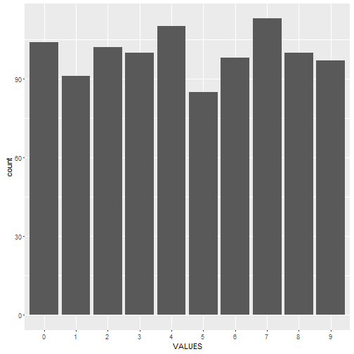
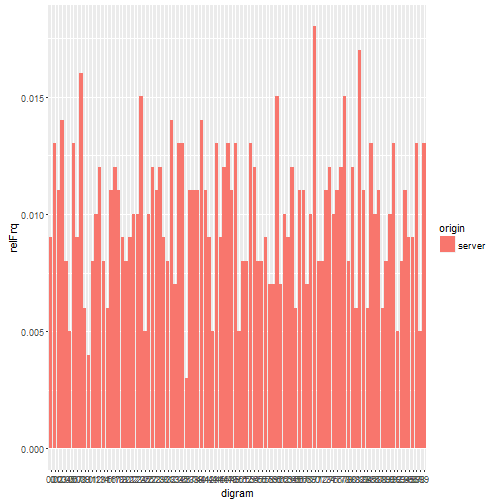
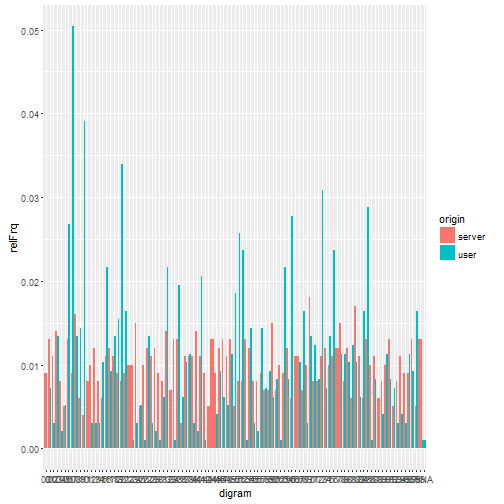

humanRandomTrainer
========================================================
author: Alexander Spray
date: 7/10/16

A note on humans and randomness
========================================================

Application - https://roastmoose.shinyapps.io/humanRandomTrainer/

Research has shown human beings to be sub-par random number
generation machines. An excellent review of the available
literature can be seen at
http://citeseerx.ist.psu.edu/viewdoc/download?doi=10.1.1.294.1160&rep=rep1&type=pdf

- Examination of digrams shows human generated random numbers
generally have more memory than computer pseudo random numbers. (they trend more)
- The "quality" of human generated random numbers has been shown to depend on
external factors
- With feedback from this app you may become a better random number generator

(this is important if you want to cheat your students' test scores... see freakonomics)

Frequency of Number occurence (uniform distribution)
========================================================

Computer pseudo random numbers are well distributed (i.e. they look like the uniform dist).
See below a histogram of the occurence of the various numbers 0-9 which occur in a sequence
1000 numbers long from the sample() function in R.

Digrams
========================================================
A consideration of their digrams shows that even their digrams (sets of two consecutive numbers)
are well distributed. Here we plot the relative frequency of occurrence of all two number pairs
in our long sequence of numbers

Human (me) generated random numbers
========================================================

Notice if I button-mash some thousand numbers, my digrams do not look as nice:
132165415521063751068150783610738170639206735207363106107351678516185950967540136520738165768419851073180763810796315706519850763852107651689871905841205173820716510765029156753250732106571096489765106358201763157984785735201635107645703820615809809180718054163754910824192541374194651703510731685416352146854698210378520832107650732701698509084985046032707651090846571803720735207359207320619509758176571852076328032707659106850491874965410768270637251067342173520971061570620798597089654171607320654109785410837652168490847198518720763827510361698491076518768190832073927032064854908140791802718178472984155575758107635073821968128735207964106097489078651807325093721645908470984168527103852052761859084794651083276073652485947852106351964101703520737206745948507419875016328073927645197816385036720635719207520673514601581975068507638207320975279165851073520795279325073592030732120796356496849878415210231032106879067326093241965749075167208378216549846541051068574685

Results
========================================================

Given that there are consistent patters in my digrams, I clearly want to change my button
mashing to avoid pattern creation. Truly uniquely random sampling can't be generated by the patterned
button mashing I'm used to. I seem for example to have hit 23 a lot. The application is built to
allow us to see our dirgram and numeral frequency plots drawn in real time. Helping to adjust our
button mashing. The amazing pros:

- better at making up fake numbers that look real
- if you're patient and have a good friend, can be used with numbers you think of and say, not just button mash
- learn about the pattern of your button mashing (could be good for mortal kombat, further research needed)
